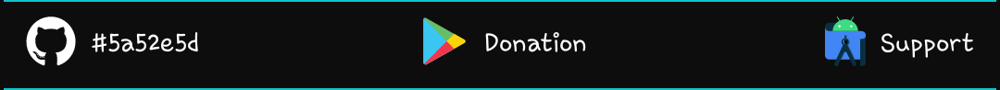
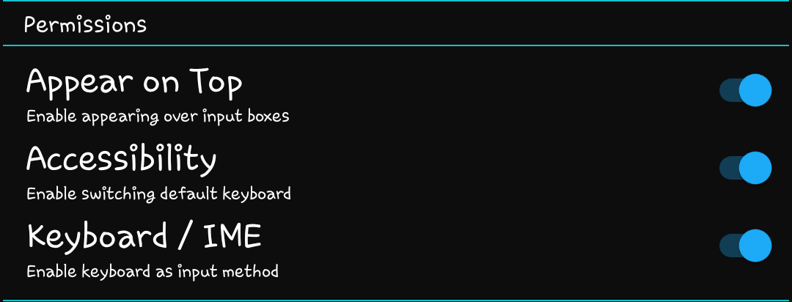

The first (and only) true Z Flip cover screen IME

After releasing the code to enable keyboards as part of SamSprung TooUI, this is a standalone cover screen IME. This project has been developed in the hope of one day being natively supported.

## Initial SamSprung Setup

The bar at the top of the settings page includes support and donation options. The first button displays the current build number and will turn red when an update is available. Clicking it will install the new version.

The middle button(s) are for donations. Google Play users will only be able to use Google Play, but GitHub users will also have a PayPal option. Donations are optional, but are greatly appreciated and fund the creation of new features. Please keep in mind that much of what you see in other cover screen apps is the result of this one. There are no restrictions on this app, meaning you are not required to unlock any features or subscribe to receive new ones.

The final button is to report bugs or request help. If you choose to provide contact details, an issue will automatically be submitted. If you would prefer to submit the issue using a GitHub account, the form will open a new issue page on GitHub. A logcat will already be copied to the clipboard and can be pasted in the logcat box.

Before reporting an issue, please make sure to install any pending updates. Updates are checked simply by launching the settings page. The button in the top left will flash red to notify of an update.

### Secure Lock Screen Setup

Settings -> Lock screen -> Screen lock type -> Fingerprints -> ON  
(Optional) Settings -> Biometrics and security -> Fingerprints -> Fingerprint always on -> OFF  
When launching an app, you will be prompted for fingerprint authentication

### System Settings Overlay

If you would like to prevent incompatibility with Settings, Developer Options provides a toggle to allow overlays. This presents some risk for untrustworthy apps to interact with your device settings and should only be enabled if you trust all apps with overlay permission.

### Permissions

Accessibility will allow the keyboard to function. The accessibility service is strictly designed to transmit user-initiated key events. All accessibility actions are one way and do not read any information from the device.

Enabling accessibility will enable the "Keyboard (IME)" settings. This is used to enable the onscreen keyboard. It only needs to be enabled as an option. It is not recommended to set it as default.

Overlay permission is what allows the keyboard to appear on top of other windows. Without it, the keyboard will not be visible when using other apps. This permission is required to use the keyboard.

### UI Options

The color bar is a theme option. Click the bar to reveal the sliders and customize your theme. There are no preset themes. The color you choose will be used throughout the various menus and icons of the keyboard interface.

Sound and vibration options should be relatively obvious, but provide audible and tactile feedback when keys are pressed. This only applies to the conventional keyboard keys. Other buttons are silent and do not vibrate.

## SamSprung Keyboard

Close the cover, launch an app, click an input box, and begin typing. It works much like the stock Android keyboard, only smaller. This keyboard will respond to normal requests to show a keyboard.

Use the direction keys at the bottom to swap between qwerty, T9, number, and handwriting pages. Additional pages may be added in future versions.

Press the X at the bottom to close the keyboard. "DONE" will also close the keyboard, but will perform the submit action associated with the current view. The action performed is set by the input box, not the keyboard.

When using the T9 keyboard, toggle prediction using the T9 button. If disabled, press a key repeatedly to change between assigned letters. Pause briefly to choose another letter from thee same key.

## Closing Remarks

This project is free and open source, as this functionality was never meant to be locked. This app has only one paid feature. Donators can submit issues directly from the menu with a logcat already attached.

There are a number of other features that are not visible when using SamSprung, but play a large role in making it run. These features, some proprietary, have been written or modified specifically for this project. Steal them if you feel you must, but don't think it goes unnoticed.
