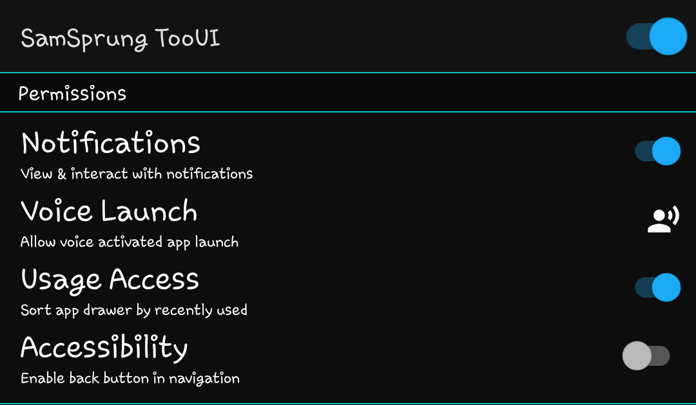
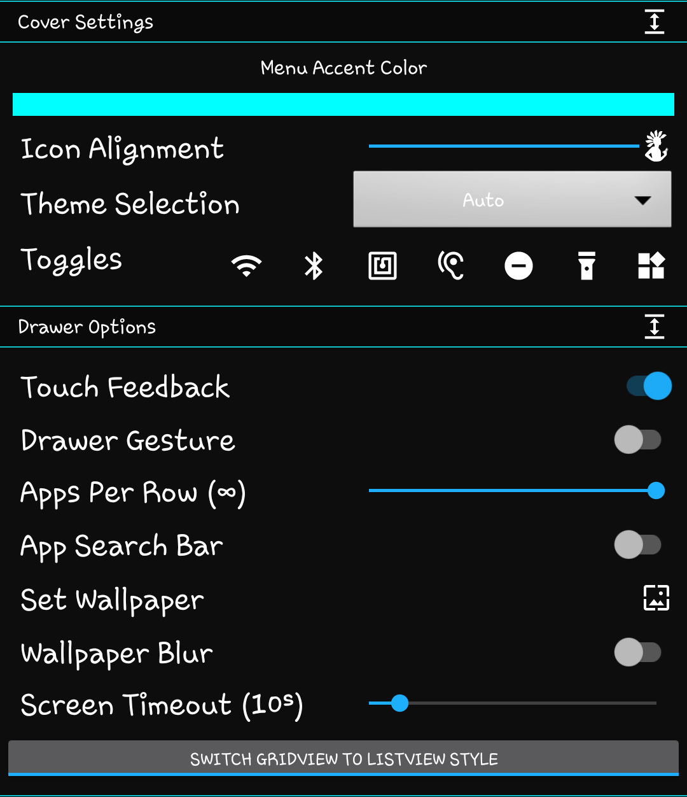
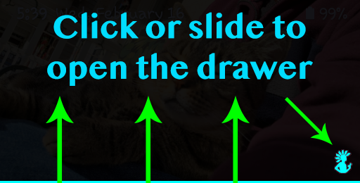

Welcome to the original "Z Flip 3 Launcher"  
A complete home experience on the cover screen.  
Available for Samsung Galaxy Z Flip 3 / 4.

This is the next innovation in cover screen apps. After pioneering app launching through the widget interface, this app has evolved into a full parallel launcher. It is now the only cover screen app to fully integrate with the stock launcher to provide all the functionality you would want without taking away any of the functionality you had.

Important: THIS IS NOT A COVER SCREEN WIDGET  
!! Questo non è un widget / Este não é um widget !!  
Compatible with Samsung Health and lock screens.

Notice: Bottom menus may be blocked by the navigation bar when launching apps. Please allow 3 seconds for the the bar to be hidden before reporting.

## Initial SamSprung Setup

When launching the app, only the main switch is required. Once you've provided overlay permission, turning on the screen with the device closed launches the app. That's it. No widget selection.

The bar below the main switch includes support and donation options. The first button displays the current build number and will turn red when an update is available. Clicking it will install the new version.

The middle button(s) are for donations. Google Play users will only be able to use Google Play, but GitHub users will also have a PayPal option. Donations are optional, but are greatly appreciated and fund the creation of new features. Please keep in mind that much of what you see in other cover screen apps is the result of this one. There are no restrictions on this app, meaning you are not required to unlock any features or subscribe to receive new ones.

The final button is to report bugs or request help. If you choose to provide contact details, an issue will automatically be submitted. If you would prefer to submit the issue using a GitHub account, the form will open a new issue page on GitHub. A logcat will already be copied to the clipboard and can be pasted in the logcat box.

Before reporting an issue, please make sure to install any pending updates. Updates are checked simply by launching the settings page. The button in the top left will flash red to notify of an update.

### Secure Lock Screen Setup

Settings -> Lock screen -> Screen lock type -> Fingerprints -> ON  
(Optional) Settings -> Biometrics and security -> Fingerprints -> Fingerprint always on -> OFF  
When launching an app, you will be prompted for fingerprint authentication

### System Settings Overlay

If you would like to prevent incompatibility with Settings, Developer Options provides a toggle to allow overlays. This presents some risk for untrustworthy apps to interact with your device settings and should only be enabled if you trust all apps with overlay permission.

### Prevent Service Termination

Settings -> Battery and device care -> Battery -> Background usage limits -> Never sleeping apps -> +  
Select SamSprung TooUI / SamSprung Keyboard -> Add

### Permissions

Notifications will enable the Android notification listener service. This is a lightweight and recently reliable method to retrieve notification content and interact with it. This service cooperates with accessibility to provide better notifications.

Voice launch provides the necessary permission to allow launching apps by long pressing the icon on the cover screen.

Accessibility will allow the back navigation button to function. The accessibility service is strictly designed for user-initiated navigation. All accessibility actions are one way and do not read any information from the device.

Usage access will allow the drawer to sort the app list by most recently used apps. This is done based on the last hour. When enabling this option, you will see your most recently used apps move to the beginning of the drawer.

Permissions are also requested for files and media to display your selected wallpaper in place of a blank background.

By default, the Bluetooth toggle will be disabled. Bluetooth requires location access and will prompt for permission when enabling this toggle. This is optional, but the toggle will not be available until enabled.

### Configuration Overview

For GitHub users, enabling the preview builds option will check for pre-release updates. Google Play users and those who do not enable this option will only receive stable updates from the original download location.

The keyboard option will display the current install state of the added keyboard. Clicking this button will open Google Play to install the keyboard (https://play.google.com/store/apps/details?id=com.eightbit.samsprung.ime).

### UI Options

If storage permission is provided, your wallpaper will also be used as a background in both the settings page and on the cover screen. This allows you to retain the personalization you've already done.

Expanding the cover settings panel will display a collection of theme and general cover settings. This includes the color for menus and buttons, placement of the icon, light or dark theme, and the available quick toggles.

The color bar is a theme option. Click the bar to reveal the sliders and customize your theme. There are no preset themes. The color you choose will be used throughout the various menus and icons of the cover interface.

Expanding the drawer options panel will reveal settings for how the drawer is opened and after it is visible.

Touch feedback controls whether or not buttons and selections will cause a short vibration.

Drawer gesture determines if the drawer can be opened by sliding it up. Disabling this improves compatibility with apps that already use a swipe gesture on the cover screen, such as Samsung Pay.

Apps per row will set the number of apps can allow apps to be spaced further apart, while the default option is to automatically fit the most apps that will still respect the predetermined margins.

The app search bar allows filtering the displayed apps using a text search. This requires some method to input text and disabling it will remove the search bar from the drawer to free up space.

The wallpaper options allow setting a wallpaper separate from the default cover screen background. This supports both static and animated wallpapers that can be blurred to prevent making the drawer hard to read.

Screen timeout is the length of delay before the screen is allowed to automatically go to sleep. This overrides the default both in and out of the drawer, so keep that in mind when setting the time.

The toggle button allows customizing the drawer format as a list with text or a grid of icons. Click the button to swap between options. The button shows the current option, followed by the option that is selected by switching.

### Notification Options

Notification snooze length is how long to silence notifications that cannot be dismissed. This would include ongoing notifications and those that require specific interaction before they can be removed.

### App Display Options

The list of apps are the ones that will be in your drawer. This list will expand when scrolled or tapped.

Toggling the switch next to an app will either hide (off) or show (on) the app in the cover screen drawer. As apps are installed or removed, this list will update. All apps are enabled by default.

## SamSprung Navigation

Swipe up on the bar at the bottom of the cover screen or tap the icon to reveal the app drawer. The bar and icon will disappear after 3 seconds of inactivity. Tap the bottom of the screen to show the bar and icon again.

The drawer can be swiped from right to left to view widgets. More information about the widget panel is included in the section below.

Swiping from left to right on the app drawer will reveal the notification page. This is explained in more detail below.

Click the search button to search the app drawer, if accessibility in enabled. Once search results are shown, click the X in the search bar to clear results or close the search by pressing the "DONE" button on the keyboard.

Swipe down to close the app drawer and return to the stock launcher view. This allows accessing the stock launcher and widgets. Swipe the bar up or click the icon to return to the app drawer at any time.

The app drawer includes a status bar, but it has been placed on the bottom. Slide this bar up or tap it to reveal a collection of quick toggles and the fingerprint unlock status.

The quick toggles, in order of appearance, are WiFi / Data, Bluetooth, NFC, sound, do not disturb (DnD), and flashlight. Clicking any one of the toggles will change its current state or provide the necessary options to do so.

## Notification Page

Notifications can be long clicked to read them aloud or clicked for available actions. All actions will apply to the notification, too. Keep that in mind before doing anything important.

If an image is included with the notification, clicking it will expand a preview. Some notifications, such as those for a screenshot, will also replace their icon with a preview of the image.

The buttons that appear on the right of a notification are dismiss and launch from top to bottom. Dismiss will cancel the notification from the status bar and SamSprung. Launch will execute the activity associated with the notification.

## Settings Notifications

When launching a notification that opens Settings, the panels become locked to the cover screen. This means that pressing the home button alone cannot clear them from the cover screen.

To close a Settings panel launched from a notification, simply press the back button in the top left. This can be done before or after using the home navigation button to return to the drawer.

## App Navigation Bar

When launching an app, a navigation bar becomes available. Swipe up from the bottom to reveal the three buttons.

The first (finger swipe) icon will close the drawer. As you will quickly realize, swiping the drawer away with such a limited area can be extremely difficult. This button will simplify that process considerably.

The second button (and the app icon) is the app drawer. Opening the app drawer will show your installed apps, but also includes a sliding drawer of its own. This drawer provides access to a collection of quick toggles. Toggle state is reflected on the drawer, along with the time and battery level for the device.

The third button (the house) is the home button. This is used from any app or the drawer to return to the stock cover screen. This is an effective means to retain access to the collection of professional widgets provided with the phone, rather than attempt to replace them with imitations.

The final button (the arrow) is the back button. This can be used to simulate pressing the system button when accessibility is enabled. Without accessibility, it will simply return the app in use to a fresh launch state.

Opening the phone while viewing an app will resume the app on screen. Exiting an app by returning to the drawer, home, or turning off the screen will place the app in the background. It can still be resumed through the recents button on the main screen.

## [SamSprung Keyboard](https://github.com/SamSprung/SamSprung-Keyboard/wiki)

## System Widget Panels

Widgets are added through the quick toggles menu. Tap the widget button to select and add a new widget. As widgets are added, you will automatically be taken to their page.

You can swipe from right to left through any other widgets you may have created, or swipe in the reverse direction to head back towards the app drawer.

By swiping to a particular widget and holding down on the widget quick toggle, the selected widget will be deleted.

There are as many pages as you can add widgets, but memory will eventually run out. All widgets are saved between uses.

## Closing Remarks

This project is free and open source, as this functionality was never meant to be locked. This app does not include a keyboard, as a keyboard is the only paid feature. The keyboard also works with other launchers, so the fee covers the cost of testing and maintaining universal compatibility.

There are a number of other features that are not visible when using SamSprung, but play a large role in making it run. These features, some proprietary, have been written or modified specifically for this project. Steal them if you feel you must, but don't think it goes unnoticed.